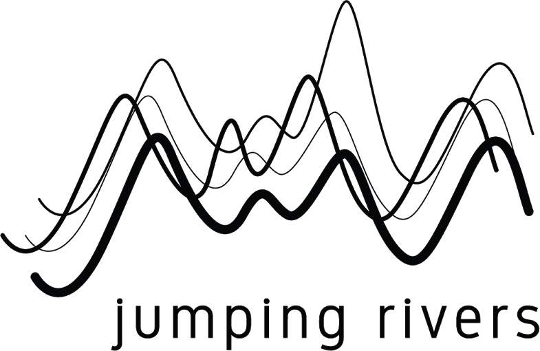

```{r setup, include=FALSE}
knitr::opts_chunk$set(echo = TRUE)

```


PyCon Limerick {data-navmenu="PyCon Limerick"}
=====================================

Column 
--------------------

### PyCon Limerick 2020

<p>

<div>
<center>

</center>
</div>

<p>

<h4>Programme and Abstracts</h4>
<p>
* Date: Saturday 29th February 2020
* Location: Strand Hotel Limerick 
* Times: 10.00am to 17:10pm approx


<div>
<center>



</center>
</div>

About {data-navmenu="PyCon Limerick"}
==============================================================

Column
-------------------------------------------------------------

### Pycon Limerick 2020

PyCon Limerick 2020 will be returing to Limerick on Saturday 29th February 2020.
This one day conference is a mixture of talks and workshops on topics related to the Python Programming Language.

Python Ireland is the Irish organization representing the various chapters of Python users. 
One of our key activities is the organization of Python Conferences. We have organized PyCon Ireland in Dublin over the last ten years.

PyCon Ireland is now a highlight in the Dublin Tech Community calendar, with 400 python users attending the conference each autumn. PyCons are very popular with companies looking to recruit new talent.

PyCon Limerick will take place on Saturday 29th February 2020 at the Strand Hotel Limerick.
We hope to bring 150-200 technologists and coders from around Ireland to the city next Spring.

We expect to present talks pertaining to

* Data Science and Machine Learning
* Big Data and Data Engineering
* Software Engineering and Development Operations
* Web Frameworks (i.e. Django)
* IOT, Sensors and Micropython
* Applications for Natural Sciences (e.g. Earth Observation, Environmental Monitoring)


Code of Conduct {data-navmenu="PyCon Limerick"}
==================================

Column
-----------------------------

### Code of Conduct

PyCon Limerick is dedicated to providing a harassment-free and inclusive conference experience for all in attendance regardless of, but not limited to, gender, sexual orientation, disabilities, physical attributes, age, ethnicity, social standing, religion or political affiliation.

We do not tolerate harassment of participants (including organisers and vendors) in any form. Sexual innuendos and imagery are not appropriate for any conference venue, including presentations.

Anyone violating these rules may be given warning or expelled from the conference (without a refund) at the discretion of the conference organisers.

Our code of conduct/anti-harassment policy can be found here.


Morning Session 1 {data-navmenu="Schedule"}
====================================

Column
-------------------------------------------------------------

### Morning Session 1

| Time   |  Room   |  Talk Title    |
|:-------|:-------|:------------------------------------------------------------|
| 10:00-10:45 | Room 1 |   **Arjumand Younus** (UCD / WiMLDS Dublin) <br> Python for Social Good |	
| 10:00-10:45 | Room 2 |   **Johannes Ahlessman** <br> Python stream processing using Python, Kafka and Faust |
| 10:00-10:45 | Room 3 |   **Laurent Picard**  <br> Building smarter solutions with no expertise in machine learning |
| | | ***(Pause)***|
| 10:50-11:20 | Room 1 |   **Krystian Czekalski** (ResourceKraft) <br> GraphQL with Python|
| 10:50-11:20 | Room 2 |   **James Nagle** (Kerry Data Science) <br> Social Network of 1916 Rising |
| 10:50-11:20 | Room 3 |   **Olga Lyashevska** (GMIT) <br> Class imbalance in gradient boosting classification algorithms: application to experimental stroke data |
| | | |
| 11:20-11:45 | | ***Coffee Break*** |


 	  	


Morning Session 2 {data-navmenu="Schedule"}
====================================
Column
-------------------------------


### Schedule

| Time   |  Room   |  Talk Title    |
|:-------|:-------|:------------------------------------------------------------|
|11:45-12:15 | Room 1	| **Dermot Canniffe** <br> Bias Engineering  |	
|11:45-12:15 | Room 2 | **Kevin OBrien**  (UCD)	<br> Building Community Events in the West of Ireland| 
|11:45-12:15 | Room 3 | **Chidubem Iddianozie** <br> Discriminative Machine Learning models for semantifying IoT data: Why, How and Lessons Learnt.	| 
| | | ***(Pause)***|
|12:20-13.05 | Room 1| **Cheuk-Ho Ting** (PyData London) <br> Are you supporting the right politician? - Graph Visualization of Voting Data	|
|12:20-13.05 | Room 2| **Stephen Finucane** (Red Hat) <br> Getting started with Sphinx and Docutils 	|
|12:20-13.05 | Room 3| **Allyn Hunt** <br> Adding data visualisation to your Flask app with React Victory charts |
| | | |
| 11:20-11:45 | | ***Lunch Break*** |

Afternoon Session 1 {data-navmenu="Schedule"}
====================================

Column
----------------------------------------------

### Schedule

| Time   |  Room   |  Talk Title    |
|:-------|:-------|:------------------------------------------------------------|
|14.15 - 14:45| Room 1 | **Miguel Grinberg** <br> I Want To Know What You Did Last Summer (engaging with the Python Community)	|	 
|14.15 - 14:45| Room 2 | |	
|14.15 - 14:45| Room 3 | |	 
|  |  |   |
|14.50 - 15.20 | Room 1 |	 **Iain Keaney**  (Skellig  ai) <br> High-Level APIs for Machine Learning	|	 
|14.50 - 15.20 | Room 2 |  **Prashant Chaubey** <br> Writing Good Python Code	|	
|14.50 - 15.20 | Room 3 |  **Stephen McEntee** <br> Trees for structure and support in Python	|	 
| | | |
|15.20-15.45 | | Coffee Break | 


Afternoon Session 2 {data-navmenu="Schedule"}
====================================

Column
----------------------------------------------

### Schedule

| Time   |  Room   |  Talk Title    |
|:-------|:-------|:------------------------------------------------------------|
|15:45 - 16.15 | Room 1 | **Matteo Perrico** <br> Customer churn prediction and segmentation techniques	|	
|15:45 - 16.15 | Room 2 | **Meghana Rathi** (UCD) <br> Playing Pong with AI	|	
|15:45 - 16.15 | Room 3 | **Jaime Buelta** (Rapid Ratings)	<br> Emotional demands of software development|	
| | | (Pause) | 
| 16.20 - 17.05 | Room 1 | **Tania Allard**  (Microsoft) <br> Reproducible data science and scientific computing: how the open source ecosystem can help|
| 16.20 - 17.05 | Room 2 | 	 **Kartik Sharma**	<br> ELK Stack with Python for Effective Logging|
| 16.20 - 17.05 | Room 3 | **Domas Zelionis** <br> Flask-AppBuilder + Customization |


Abstracts for Morning Session 1 {data-navmenu="Schedule"}
=====================================


Column {.tabset}
-------------------------------------------------

Abstracts for Morning Session 1

### Room 1


<h5>Build a customizable Flask application (Domas Zelionis)</h5>

Build a customizable Flask application with MongoDB and user authentication in 4 lines of code, with Flask-appbuilder.

Flask is a web server micro-framework designed to make getting started quick and easy, Flask-appbuilder is a framework/code-generator that takes the pain out of project setup and configuration.

This talk will walk through the process of building a Flask application with MongoDB (or any SQL / noSQL database) and authentication using the Flask-appbuilder framework.

The talk will feature:

* A live coding demonstration of the project setup.

* Enable authentication, including user roles and privileges.
* Overview of setting up your MongoDB and database connections.
* Customization and styling for your project.
<p>

<h5>GraphQL with Python </h5>


* The talk will be about GraphQL technology. What is GraphQL and why we might use it. 
* What are the advantages and disadvantages of using GraphQL. 
* I will talk about the main concepts in GraphQL like schemas, types, queries, mutations, and subscriptions.
* I will show how to implement GraphQL with python using an example with Graphene and Django. 
* I will have a demo with a sample app build in Django that will serve as a GraphQL API.


### Room 2


<h5> Social Network Analysis of the 1916 rising (James Nagle)</h5>

In 2015 the National Archives released files which had been compiled by the Dublin Metropolitan Police 100 years beforehand. From June 1915 to April 1916 they followed members of groups such as Sinn F?in, the Irish Volunteers and the Gaelic League and reported on who they were seen talking to. Using these files, the python library networkX and the open source network analysis package Gephi, I was able to build a social network of the interactions recorded.

The resulting network supports well known facts about the planning around the 1916 Rising but also presents interesting questions surrounding figures who are rarely mentioned in Irish history but feature prominently in the network. During the reporting on these files at the time of their release these figures were overlooked as their importance could not be seen by a cursory glance. The network can also be used to understand what type of information the D.M.P. had in relation to the separatist movement and judge the effectiveness of their intelligence gathering.

This talk would serve as an introduction to social network analysis in python and the use of the networkX library and Gephi. If there is already a talk on this area I could discuss the use of data science in the study of Irish history. I have also applied natural language processing to the Anglo Irish Treaty debates and am currently looking at how python can be used to analyse the police books containing all arrests made by the DMP from 1905-1918.

All these projects focus on taking large, inaccessible data sets, presenting and visualising them in interesting and informative ways and extracting valuable findings from them. Some findings and visualisations of the 1916 network can be found here: http://www.anquantarbuile.com/social-network-of-the-1916-rising and the Anglo Irish Treaty debate project can be found here: http://www.anquantarbuile.com/treaty-debates

### Room 3

<h5>Building smarter solutions with no expertise in machine learning (Laurent Picard)</h5>


* ML? API? AutoML? Python is the language of choice to solve problems with machine learning, but what can we build in only a few hours or days and without any expertise? 

* In this session, we'll see how to benefit from existing ML models and how to create a custom model with AutoML techniques. 

* We'll also be active players of a live demo, so don't put your smartphone on airplane mode!

<h5> Class imbalance in gradient boosting classification algorithms (Olga Lyashenka) </h5>
Class imbalance in gradient boosting classification algorithms: application to experimental stroke data


Abstracts for Morning Session 2 {data-navmenu="Schedule"}
=====================================

Column {.tabset}
-------------------------------------------------

Abstracts for Morning Session 2

### Room 1

<h5> Bias Engineering (Dermot Caniffe)</h5>

Bias Engineering is the tendency of people to engineer their own implicit biases into the products they create. And it could also be the effort to reduce these implicit biases in developed products.

I had been looking in particular at the Dunning-Kruger effect and how it pertains to software development.

<p>
<hline>

<h5> Are you supporting the right politician? (Cheuk-Ho Ting)</h5>

Are you supporting the right politician? - Graph Visualization of Voting Data 


### Room 2

<h5> Understanding multithreading by deciphering the Cpython Intepreter source code </h5>

In the modern era of hybrid cores and processors, there is an in demand need for concurrent and parallel programming paradigms. Python, since its inception has amazing support for single threaded applications. The extensive use of Python in booming fields like Machine Learning has paved the way to constantly improve multi-threaded applications in Python.

I will speak from ground level covering very crucial aspects of Threading and Locks which will provide a better roadmap for community to develop better Python applications.

Program outcomes:
* How threading can improve performance, its pros and cons.
* What works best in which environment between threads and processes.
* Why GIL matters the most in Python
* How to leverage the power of open source source code to understand the crux of language.


<p>
<hline>
<h5> Getting started with Sphinx and Docutils (Stephen Finucane) </h5>

Documentation, automation "If you've read documentation for a Python library, you've almost certainly seen the end product of a docutils or Sphinx-powered documentation toolchain. Sphinx builds upon docutils and together, they provide the tool of choice for a majority of projects across the Python ecosystem.

One of the great advantages of both tools is their inherent customisability and extensibility: not only can you customise the output of the tools, be that HTML, LaTeX or something else, but you can also write extensions that allow you to do things up to and including automatically generating documentation for you.

In this presentation, which is part talk, part workshop, we'll look at the basics for building and using your own extension for these tools, with the goal of solving the kinds of issues that have been seen in large Python-first communities like OpenStack. Some prior Python experience will be necessary, but no Sphinx or docutils experience is assumed."

### Room 3

<hline>
<h5> Discriminative Machine Learning models for semantifying IoT data (Chidubem Iddianozie) </h5>

Discriminative Machine Learning models for semantifying IoT data: Why, How and Lessons Learnt.

<p>
<hline>
<h5>Adding data visualization to your Flask app with React Victory Charts (Allyn Hunt)	</h5>

Flask is a web server micro-framework designed to make getting started quick and easy, with the ability to scale up to complex applications. Victory is a set of React.js components for modular charting and data visualization.

This talk will focus on adding data visualization to Flask applications by using the amazing React Victory library.
Presenting data in web applications can be a daunting task, web applications make it very easy to store large amounts of data into your database of choice but many applications struggle with finding a way to display this data in a meaningful way. Server side rendering of charts can work but often lead to a slower and poor user experience.
This talk proposes a solution by integrating a React frontend onto your Flask application, and taking advantage of the powerful and flexible React Victory library for data charting and visualization.

This talk will cover the following topics:
* Discussing the benefits of using a JS frontend.
* Integrate a React frontend into your Flask app.
* Installing and setting up the Webpack, Babel and Victory libraries.
* Creating an API endpoint to send JSON data.
* Fetching API data from your React frontend.
* Some security concerns and how to resolve them.
* Displaying chart data with Victory charts.
* How to customize the charts.

<p>

Abstracts for Afternoon Session 1 {data-navmenu="Schedule"}
=====================================

Column {.tabset}
-------------------------------------------------

Abstracts for Afternoon Session 1

### Room 1

<h5> I Want To Know What You Did Last Summer (Miguel Grinberg) </h5> 
We all love to learn about the cool things others make, but we tend to think those who write or talk publicly about their projects are rare and specially gifted individuals, while in fact they are normal people just like you and I. I started sharing my projects with the community many years ago, and all sorts of good things happened to me as a result of that, so in this talk I'm going to make a case for why you should start sharing too!
<p>
<hline>

<h5> High-Level APIs for Machine Learning (Iain Keaney) </h5>

* An introduction to the python high-level APIs for machine learning, that allow coders to get started on building and deploying models much quicker without knowing the mathematics behind machine learning. 
* May also discuss deployment in both cloud and/or edge.

### Room 2

<h5> Machine learning to trade and make money! (Niall O'Connor) </h5>

* After a period of day trading I will use historical data to learn how to automate my trading style so I can make money without doing anything!!

* By analysing and selecting key signals from market data I will attempt to discover a pattern for trading.

* All of this will be done on a commodity single cpu. ( No mining costs required )

<p>
<hline>
<h5> Writing Good Python Code (Prashant Chaubey)</h5>

We love python because of its readability, massive ecosystem, vibrant community etc. and the list goes on. However, like other programming languages, it is easy to write cryptic, unmaintainable, and rigid python code. In short an ugly code(I can give an example). Moreover in teams, this problem escalates as different developers have diverse code styles. How to ensure code quality and homogeneity? PEP 8 is a style guide of python code.

We can use "pylint", which is a source code, bug, and quality checker for python and follows the style recommended by PEP 8(I can give an example on how to use it). In addition to "pylint", we have several other tools suited for different purposes. "mypy" provides optional static typing, "pydocstyle" checks compliance with Python docstring conventions, "bandit" finds common security issues in Python code, and "black" is a Python code formatter. How to get your team in sync with these tools?

We can use build pipelines and/or pre-commit hooks. A build pipeline is a set of tasks, each of which performs a step in your build process(I can give an example of an Azure DevOps pipeline). Pre-commit hooks are used to inspect the snapshot that's about to be committed. "pre-commit"( https://pypi.org/project/pre-commit/) is a framework for managing and maintaining multi-language pre-commit hooks. We can easily configure it using a "pre-commit-config.yaml" file(I can give an example of using the above-mentioned tools with pre-commit).

### Room 3

<h5>Python for Social Good (Arjumand Younus)</h5>

As a data scientist, I am into making meaning from data and Python is the main tool for it.

However does this meaning translate into impact; and how can we come up with projects that provide huge societal impact.

I will delve into some example projects of my own while also giving examples of how Python helped with quick analysis.

This talk will be different from your traditional Python talks because of the interactive nature while we try to think of "Data Science for Social Good" projects.
<p>
<hline>

<h5> Trees for structure and support in Python (Stephen McEntee) </h5>

Tree data structures are pervasive in computing, they enable us to organise information in a natural hierarchical fashion that can be very effective, as well as being convenient and intuitive. Python does not provide a built-in tree object for general use, but it's not difficult create trees in Python.

This talk presents some of the ways of constructing trees in Python, and examines a selection of some of the many applications of trees, including their uses in GUIs, data management, spatial partitioning, and decision analysis. We look at various interesting tree modules and applications in the wider Python ecosystem, and beyond.

Finally, the talk introduces the presenter's own Python package «vntree», examines some of its features, and demonstrates how it can be used to provide structure and support for various applications.


Abstracts for Afternoon Session 2 {data-navmenu="Schedule"}
=====================================

Column {.tabset}
-------------------------------------------------

Abstracts for Afternoon Session 2

### Room 1

<h5>Customer churn prediction and segmentation techniques	(Matteo Perrico)</h5>

My project tries to address a common problem in the field of supermarkets and retail: customer churn.

The work provides some ideas and developments to deal with this problem effectively.  The project was conducted on four supermarkets in Italy, considering the sales figures for 2018.

The work is developed in two main parts:

* the first part analyzes some customer segmentation techniques present in the literature, with the aim of developing a customized model to identify the customer churn. 

* The second part is the concrete application of the model of created, analysis of results and implementation of some predictive models to apply customer loyalty techniques.

The developed model is the result of some customizations of the basic RFM model. 

The goal is to interpret the behavior of customers, trying toindentify the significant changes over time.


<h5> Reproducible data science and scientific computing (Tania Allard) </h5>
Reproducible data science and scientific computing: how the open source ecosystem can help


### Room 2

<h5> Playing Pong with AI	(Meghana Rathi) </h5>


My project was based on using reinforcement learning specifically Q-learning and model predictive control to develop an agent that can play the atari game of PONG. 

* I coded in Python to create my agent and used the OpenAI gum library to set up the game environment. 
* This project was to prove the concept that AI can be made safer and reliable when used in collaboration with control engineering tools. 
* The work from my project is now published online at https://arxiv.org/abs/1911.04400?context=cs.LG	

<h5> ELK Stack with Python for Effective Logging	(Kartik Sharma)</h5>

System logging becomes one of the necessary parts in system design because of the large scale and a wide variety of data information systems are handling. Through this platform, I want to give our techies and other people in the audience an insight into the importance of logging and facilitating its features through ELK stack. ELK stands for Elastic, Logstash and Kibana, Through these 3 technologies, developers can create, store and visualize the working of the systems. These visualization also helps all the stakeholders with the relevant information of the system health. Daily cron or triggers can be set up in order to monitor the health of the system continuously. 

I am Kartik Sharma, Software Development Engineer in one of the topmost technology companies in India. I have an experience of more than 3 years in designing and development of scalable and robust products that handles more than 20 million transactions per day. My first company Mobikwik, India's 2nd largest E-wallet and payment solutions company, I was being the lead developer for Payment solutions for tech giant Uber. Uber integrated our customized development solution for charging their merchants. 

This main objective for this project is to implement a scalable and robust solution that can process >200 Transaction per sec. Other projects include Transactions reconciliation mechanisms for Zomato in which the bottleneck was handling scale with spring transaction management properties, implementing a solution transferring exception handling responsibilities to Mysql procedures and thread-based group solutions. My team had faced this problem and figured this as the best solution. 


### Room 3


<h5> Emotional demands of software development	(Jaime Buelta) </h5>

* A not talked too much part of being software developer is to handle the emotional and psychological demands of the work. 
* The pressure is high, and imposter syndrome cramps up. 
* In this talk we will talk about difficulties in handling the work and learn how to handle our emotions and fears is an important ability in a long career.	


Workshops {data-navmenu="Workshops"}
==================================

Column {.tabset}
-----------------------------

### Workshop 1 (Morning)

<h5> Introduction to Github (2 Hours) </h5>

* Presenter: Jamie OWen ([Jumping Rivers](www.jumpingrivers.com))
* Beginners friendly, and aimed at Students
* Taking place in Henehan Suite - Venue Capacity is Approx 30

### Workshop 2 (Morning)

<h5>  Machine learning and high-performance computing with PyCall </h5>

* Presenter: Paul Palmes (IBM Dublin)
* Taking place in De Lacey Room  - Venue Capacity : Approx 10

### Workshop 3 (Afternoon)

<h5> A Python ROS framework to build your own robots from </h5>

* Presenter: John O'Reilly
* Taking place in Henehan Suite - Venue Capacity is Approx 30

Lunch
====================================

### Lunch 

There is no arrangements made for lunch as standard, although we have made special arrangements at the hotel for those who have requested it.


<h5> Where to go for Lunch</h5>
There are several wonderful places to have lunch in walking distance of the venue.
<p>
Very popular options include:

* [The Curragower Seafood Bar and Restaurant](https://curragower.com/) - Expect a lot of people to go there.
* [Hook and Ladder](https://www.hookandladder.ie/) on Sarsfield Street
* [La Cucina](http://lacucina.ie/) on Henry Street.
* [Milanos](http://milano.ie/our-restaurants/restaurant-details/Milano-Limerick) on Honan's Quay - On the riverfront facing the hotel, with lots of room.
* [The Hunt Museum Cafe](https://www.huntmuseum.com/cafe/)


Post Conference Social 
==================================

Column
-----------------------------

### Post Conference Social 


<p>

<div>
<center>

</center>
</div>

<p>

<br>

The PyCon Limerick 2020 will conclude with a social event at J.J. Bowles on at 17:30.


